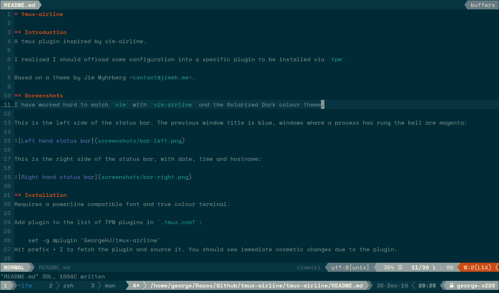
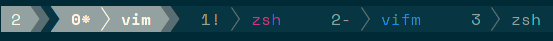
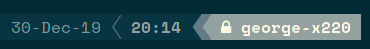

# tmux-airline

## Introduction
A tmux plugin inspired by vim-airline.

I realised I should offload some configuration into a specific plugin to be installed via `tpm`

Based on a theme by Jim Myhrberg <contact@jimeh.me>.

## Screenshots
I have worked hard to match `vim` with `vim-airline` and the Solarized Dark colour theme.

This is the left side of the status bar. The previous window title is blue, windows where a process has rung the bell are magenta:

This is the right side of the status bar, with date, time and hostname:

## Installation
Requires a powerline compatible font and true colour terminal.

Add plugin to the list of TPM plugins in `.tmux.conf`:

    set -g @plugin 'GeorgeHJ/tmux-airline'
Hit prefix + I to fetch the plugin and source it. You should see immediate cosmetic changes due to the plugin.

## Configuration
There are currently no options to set—watch this space!
